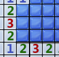
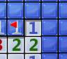
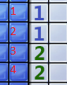
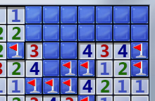

# Алгоритм, помогающий выиграть в сапёра
## Вступление
Далее я буду подразумевать, что вы знакомы с правилами игры сапёр. Если нет, то ознакомьтесь с ними перед тем, как продолжить чтение.

Процесс игры можно рассмотреть как комбинацию пяти случаев. Причём на каждом ходу желательно сначала поискать случаи 1 и 2, если не получится, то приступить
к поиску 3 и 4. Если же и это не выйдет, то приступить к пятому. 

Условимся, что количество мин вокруг цифровой ячейки - это её вес.
#### Первый случай


Здесь всё просто, если количество неоткрытых ячеек вокруг цифровой ячейки равно её весу, то во всех этих неоткрытых клетках находятся мины.
На рисунке это выполняется для любой цифровой клетки, кроме самой нижней правой двойки.
#### Второй случай


В этом случае тоже всё довольно очевидно. Если вокруг цифровой ячейки количество мин (флажков) совпадает с её весом, то все другие клетки можно смело открывать, 
так как можно точно быть уверенным, что там не мины (конечно, если флажки поставлены правильно, подразумевается, конечно, что всё верно).

#### Третий случай


Этот случай, как и четвёртый, уже не такой интуитивный, и большинство начинающих игроков останавливаются на первых двух. 
С помощью данного случая мы можем указать местоположение мины.

В этом примере нижняя единица даёт информацию, что в ячейках 1, 2 и 3 содержится только одна мина. А это так же значит, что в ячейках 2 и 3 не может быть
две мины. С другой стороны верхняя двойка говорит о том, что в ячейках 2, 3 и 4 должно быть ровно две мины. Но в 2 и 3 может быть только одна мина, 
поэтому делаем заключение о том, что в 4 ячейке точно есть мина. 
#### Четвёртый случай


Данный случай можно рассмотреть как противоположность третьему, он позволяет открыть ячейку, свободную от мины.

Верхняя единица говорит о том, что в ячейках 1, 2 и 3 есть ровно одна мина. Нижняя же подсказывает, что в ячейках 2 и 3 тоже ровно одна мина.
Но раз мина во 2 и 3 ячейках, то в 1 её точно нет.

Третий и четвёрный случай часто идут рука об руку. Так, например, в третьем случае после того, как мы определили, что мина есть в 4 клетке, то верхняя двойка
теперь даёт информацию о том, что в ячейках 2 и 3 ровно одна мина. Тогда уже пользуясь четвёртым случаем заключаем, что в 1 ячейке нет мины.

#### Пятый случай

 
Самый грустный случай. Если мы пришли к нему, то, значит, мы не можем точно определить местоположение мины или свободной от неё ячейки. Остаётся только угадывать :(

Так как сапёр является игрой-головоломкой, то хотелось бы, что здесь не было элементов удачи, но, к сожалению, это не всегда так.

## Основная часть
Пусть наше поле будет m * n, где m - высота, n - широта. Подразумевается, что n >= m. Пусть у нас есть два списка ячеек: 
unopened_cells - неоткрытые ячейки, рядом с которыми есть цифровые ячейки; digital_cells - цифровые ячейки, которые являются 
соседними к unopened_cells. 

Сам алгоритм состоит из нескольких частей. Сначала он будет искать все случаи с первого по четвёртый. Если это получится, то он
должен вернуть все ячейки, которые нужно открыть и в которых есть мины, и завершить работу. Если же не получится, то алгоритм перейдёт ко второй части,
в которой будет рассчитывать вероятности нахождения мин в каждой из unopened_cells.

### Первая часть алгоритма 
Рассмотрим два варианта реализации алгоритма решения сапёра. 
#### Матричный способ
Пронумеруем все ячейки из unopened_cells.
Составим расширенную матрицу A размера |digital_cells| * |unopened_cells| (|a| - количество элементов в a). Так как ячейки пронумерованы, то
i-му столбцу матрицы будет соответствовать i-ая ячейка из unopened_cells.
Матрица заполняется построчно: берём ячейку c из digital_cells, смотрим на неоткрытые ячейки вокруг неё. Ставим единицу в матрицу A там, где должна быть каждая ячейка.
Так как матрица расширенная, то фактически у неё |unopened_cells| + 1 столбцов, где самый правый - это вес ячейки минус количество флажков вокруг неё.

Например, составим матрицу для третьего случая (ячейку над первой пронумеруем как 0, а ячейку под четвёртой как 5, так как они не открыты):
```
(1 1 1 0 0 0|1)
(0 1 1 1 0 0|1)
(0 0 1 1 1 0|2)
(0 0 0 1 1 1|2)
```
Далее используем метод Гаусса для нашей матрицы. В левой части матрицы будут только элементы -1, 0 и 1. Справа будет какое-то целое число.
Теперь проанализируем строки матрицы. 
+ Если в левой части есть только единицы и нули, причём количество единиц равно числу справа, то во всех ячейках, соответствующих единицам, стоят мины. 
Аналогично, если будут стоять минус единицы и нули, а число справа будет отрицательно.
+ Если в правой части стоит ноль, а в левой части все единицы одного знака, то их можно открывать, так как в них нет мин.
+ Если в правой части стоит положительное число, и оно равно количество плюс единиц в левой, то плюс единицы - это мины, а минус единицы - нет
+ Как в предыдущем пункте, но с другим знаком.

Первые два пункта не должны вызывать вопросов, но последние два надо пояснить. Строка нашей матрицы по сути задаёт уравнение. Например, 
(1 1 0 -1|2) преобразуется в уравнение x1 + x2 - x4 = 2, причём каждый из иксов либо 0, либо 1. Тогда становится очевидно, что это уравнение
при таких условиях имеет только одно решение: x1 = x2 = 1, x4 = 0.

Заметим, что изначально в каждой строке не более восьми единиц (так как вокруг каждой ячейки может быть максимум восемь неоткрытых ячеек).
Пусть восемь ячеек вокруг ячейки называется её областью. Тогда как количество столбцов может быть порядка m * n. Можно понять, 
что мы тратим очень много пямяти на нули в матрице, которые по сути не будут использоваться.
unopened_cells, digital_cells <= n * m <= n^2, то есть размер матрицы |A| <= n^4. Тогда алгоритм затратит O(n^4) памяти. 
Метод Гаусса для матрицы n * n работает за O(n^3), тогда в нашем случае сложность по времени будет O(n^6).

#### Метод групп
Этот метод похож на матричный, но всё же отличается. Здесь будем хранить список групп groups. Группа - это по сути строка матрицы,
в ней хранится множество неоткрытых ячеек cells и вес w - вес ячейки минус количество флажков в её области. Изначально группы создаются для
каждой ячейки из digital_cells.

Попарно для групп производим некую операцию до тех пор, пока группы не перестанут изменяться, не будут добавляться новые и не будут удаляться существующие.
Теперь подробнее об этой операции. Последовательно проверяем следующие пункты, если выполнили один, то операция завершается.
+ Если группы одинаковые, то удаляем одну из них.
+ Если множество ячеек в одной группе является подножеством ячеек в другой, то из большей группы "вычитаем" меньшую. То есть в большей
группе вес станет разностью весов большей и меньшей группы, множество cells станет разностью множеств.

Пример (ячейки обозначены цифрами, но вместо этого должны быть координаты): ({1, 2}, 1) и ({1, 2, 3}, 1) -> ({1, 2}, 1) и ({3}, 0)
+ Если группы пересекаются, то пробуем выделить пересечение в новую группу. Это получится, если мы столкнёмся с третьим или 
четвёртым случаем из введения (или с обоими сразу). Рассмотрим критерий, когда удастся выделить пересечение. Пусть Gb - группа с большим
количеством мин, Gl - другая группа, k - число ячеек в Gb минус число ячеек в пересечении. Если k равно весу Gl, то мы можем выделить новую
группу. Её ячейки - пересечение групп, вес - k. Вычитаем из Gb и Gl новую группу.

Пример: ({1, 2, 3}, 1) и ({2, 3, 4, 5}, 3) -> ({2, 3}, 1), ({1}, 0) и ({4, 5}, 2)


Как только алгоритм закончится, мы получим два типа групп, про которые мы можем точно что-то сказать:
+ Количество ячеек равно весу. Все ячейки - мины.
+ Вес равен нулю. Все ячейки - не мины.


Количество групп будет не больше n^2, размер каждой группы O(1) (так как не более восьми элементов + вес) => сложность по памяти O(n^2).
Так как размер группы O(1), то операция пересечения групп требует O(1) времени. В остальном сам алгоритм схож с методом Гаусса, 
поэтому оценим его сложность как O(n^6).

Таким образом, выберём вариант реализации с помощью групп, так как он требует меньше памяти.

### Вторая часть алгоритма 
